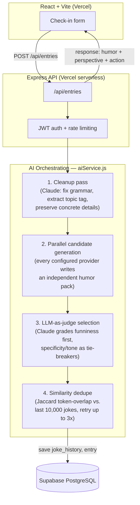

# ReLOL 😂 — Your 3-Minute Mood Booster

Turn today's frustration into a laugh, a fresh perspective, and one small action.

[](https://react.dev)
[](https://vitejs.dev)
[](https://expressjs.com)
[](https://supabase.com)
[](https://vercel.com)

---

## What it does

A user writes one or two sentences about their day and picks a mood. ReLOL turns that into a
**localized comedic reframe** — a joke written in the style of a well-known regional comedian
(Vadivelu, Brahmanandam, Johnny Lever, and others), a genuinely warm perspective shift, and one
concrete next step. The goal is a real smile or laugh, not generic "stay positive" platitudes.

The interesting part isn't the CRUD — it's the **AI orchestration pipeline** that turns a raw diary
entry into something that actually lands as funny, personalized to the user's language, culture,
and personal favorites, while staying deduplicated across tens of thousands of past jokes.

---

## Architecture



---

## Why the AI pipeline is built this way

This is the part worth walking an interviewer through — every stage exists because a simpler
version of it produced worse jokes.

| Stage | What it does | Why it's not simpler |
|---|---|---|
| **Cleanup** | Claude rewrites the raw entry into 1-2 concise sentences, explicitly instructed to *preserve* concrete nouns (names, objects, numbers) instead of smoothing them into generic phrasing. | A comedy writer needs a specific detail to build a joke around — losing "the chips packet" to "a snack" kills the punchline before it's written. |
| **Multi-provider generation** | The cleaned entry is sent **in parallel** (`Promise.allSettled`) to every provider with a configured API key, each returning an independent `{humor, perspective, action, song}` candidate. | One model's failure or off-day doesn't block the request, and having multiple candidates gives the judge step something real to select between. |
| **LLM-as-judge selection** | A dedicated grading prompt (currently always Claude, chosen for consistently the strongest comedic judgment across providers) ranks candidates by **actual funniness first** — a technically well-built but flat line explicitly loses to a genuinely funnier one — with specificity and tone-matching as tie-breakers. | Early iterations weighted "specific" and "funny" equally, which rewarded clever-sounding-but-flat lines. Separating "would a person actually laugh" from "is this well-constructed" fixed that. |
| **Similarity dedupe** | The winning line is scored via normalized token-overlap (Jaccard similarity) against the last 10,000 saved jokes. Above a 0.55 threshold, it retries — up to 3 times — feeding the too-similar lines back as an explicit "don't reuse this angle" instruction. | Anthropic doesn't expose a public embeddings endpoint, so a real embeddings + cosine-similarity dedupe would mean a second API key. Token-overlap is cheap, dependency-free, and reliably catches near-duplicate phrasing, which is the actual failure mode being guarded against. |
| **Localized comedy style** | Prompts are branched per `motherTongue` (Tamil, Telugu, Kannada, Malayalam, Hindi) into that language's colloquial Latin-letter form (Tanglish, Tenglish, Kanglish...), each with a named comedian and their **specific comedic mechanism** spelled out (e.g. Vadivelu's "brahmanda kashtam" universe-scale-despair escalation, Johnny Lever's pause-then-punch delivery) — not just "write it in a funny style." | Abstract style instructions ("be funny like X") reliably produced generic jokes. Naming the exact performative beat gives the model something concrete to execute. |

**Provider roster is intentionally curated, not just "everyone with a key":** Gemini and Groq are
both wired up (`geminiClient.js`, `groqClient.js`) but excluded from the joke-writing pool in
`providers.js` based on direct quality comparison during testing — Gemini's key is reused for the
meme-image feature instead, and Groq's smaller model measurably weakened output when it entered
the judge rotation.

---

## Feature tour

- **Daily check-in** — pick a mood (1-5) and a category, describe what happened, get an instant
  AI-generated humor/perspective/action pack, rate-limited to a few check-ins per day.
- **Regenerate** — user-triggered "give me a different joke," seeded with the current joke as an
  explicit avoid-angle so the rewrite is forced to take a new approach.
- **Personal favorites** — users can list a favorite comedian, musician, or personality; the
  generation prompt is instructed to weave one in *only* when it creates a genuinely natural
  connection, never forced into every response.
- **Meme stickers** — an optional, user-triggered feature that picks a real Imgflip template
  (including curated Vadivelu/Brahmanandam film-still templates) and captions it via Claude —
  template-based rather than freeform AI image generation, which is far more reliable for actually
  landing a joke.
- **Community feed** — users can anonymize and share an entry; anonymization runs through a second
  Claude call (never just showing a private raw entry) plus a regex backstop for emails, phone
  numbers, links, and handles, with three-way voting (funny / smile / not funny).
- **Streaks** — daily-checkin streak tracking with correct same-day/consecutive-day/gap handling.

---

## Tech stack

| Layer | Choice |
|---|---|
| Frontend | React 18, Vite, React Router, Tailwind CSS |
| Backend | Node.js, Express, deployed as Vercel serverless functions |
| Database | PostgreSQL via Supabase |
| Auth | JWT access + refresh tokens, bcrypt password hashing |
| AI providers | Anthropic Claude (primary + sole judge), OpenAI (optional), Moonshot (optional) — Gemini and Groq present but excluded from joke-writing by design |
| Images | Google Gemini image model (memes), Imgflip API (caption rendering) |

---

## Project structure

```
relol/
├── backend/
│   ├── api/index.js          ← Vercel serverless entry point
│   └── src/
│       ├── server.js         ← Express app, route mounting, error handling
│       ├── config/db.js      ← PostgreSQL connection pool
│       ├── db/schema.sql     ← Full schema + idempotent migrations
│       ├── middleware/auth.js
│       ├── routes/           ← auth, entries, community, dashboard, profile, interests
│       └── services/
│           ├── aiService.js       ← the pipeline described above
│           ├── providers.js       ← curated multi-provider roster
│           ├── similarityService.js
│           ├── anonymizer.js
│           ├── memeService.js / imgflipClient.js
│           └── anthropicClient.js / openaiClient.js / groqClient.js / geminiClient.js / moonshotClient.js
└── frontend/
    └── src/
        ├── pages/             ← Home, StorySoFar, MoodBoost, Profile, Login, Signup, Privacy, Terms
        ├── components/        ← BottomNav, ResultCard, MoodSelector, CategoryChips, StreakBadge...
        ├── api/client.js      ← all API calls
        └── context/AuthContext.jsx
```

---

## API surface

| Endpoint | Method | Purpose |
|---|---|---|
| `/api/auth/signup`, `/login`, `/refresh` | POST | JWT-based auth |
| `/api/entries` | POST | Submit a check-in, run the AI pipeline, persist result |
| `/api/entries/today` | GET | Today's entry + remaining check-in count |
| `/api/entries/:id/regenerate-humor` | POST | Re-run generation, steering away from the current joke |
| `/api/entries/:id/sticker` | POST | Generate (or fetch cached) meme sticker |
| `/api/entries/history` | GET | Paginated past entries |
| `/api/community/share/:entryId` | POST | Anonymize and publish an entry to the feed |
| `/api/community/feed` | GET | Paginated public feed |
| `/api/community/feed/:postId/vote` | POST | Funny / smile / not-funny voting |
| `/api/profile`, `/api/interests` | GET/PUT | User profile and personalization settings |

---

## Data model highlights

- `entries` — one row per check-in: raw + cleaned text, mood, category, the generated humor pack,
  which provider wrote the winning joke, and an optional cached sticker.
- `joke_history` — every joke ever generated plus its pre-computed normalized token string, the
  rolling 10,000-row dedupe window queried on every generation.
- `community_posts` / `votes` — anonymized public shares with a unique-per-user-per-post vote
  constraint enforced at the database level.
- `interest_categories` / `interest_items` / `user_interests` — a generalized personalization
  system (favorite comedian, musician, actor, etc.) with trigram-indexed fuzzy name search.

Full schema, including every idempotent migration, lives in
[`backend/src/db/schema.sql`](backend/src/db/schema.sql).

---

## Running it locally

```bash
# Backend
cd backend
cp .env.example .env    # fill in DATABASE_URL, JWT secrets, ANTHROPIC_API_KEY
npm install
npm run dev              # http://localhost:4000

# Frontend (separate terminal)
cd frontend
cp .env.example .env     # VITE_API_BASE_URL=http://localhost:4000/api
npm install
npm run dev               # http://localhost:5173
```

Database: run `backend/src/db/schema.sql` once against a Supabase Postgres instance via the SQL
Editor.

---

## Deployment

Both frontend and backend deploy as separate Vercel projects (`backend/vercel.json` builds the
serverless entry point at `api/index.js`; `frontend/vercel.json` is a standard Vite SPA build with
history-API-fallback rewrites), backed by a Supabase-hosted Postgres instance. Free tier covers the
first few hundred users on every service in the stack.

---

## Cost estimate

| Service | Free tier | Paid if you exceed |
|---|---|---|
| Vercel (frontend) | Unlimited | — |
| Vercel (backend) | 100GB bandwidth, 100k invocations/month | ~$20/mo |
| Supabase | 500MB database, 2GB bandwidth | ~$25/mo |
| Anthropic API | Pay per use | ~$0.001 per check-in |
